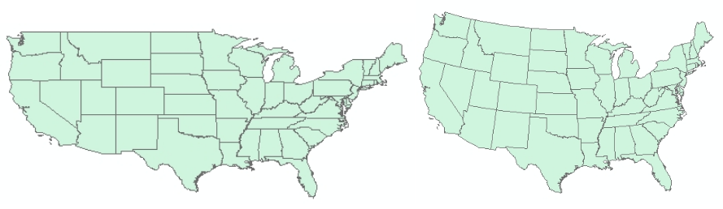

# Use a different map projection

By default, ArcMap will display your map using the coordinate system, or map projection, of the first layer you added. This can especially be an issue for large, continental-scale maps. For example, if the first data layer uses latitude and longitude coordinates, a map of the United States may look slightly stretched out, like the map on the left:

The map on the right uses an Albers Equal Area projection, which ensures that states with equal land area appear with equal areas on the screen (or paper). It also adds a gentle curve to the long northern border with western Canada. Here's how to change the projection of the map:

1. View menu > Data Frame Properties...
2. Click the "Coordinate System" tab, and you'll see the current coordinate system.
3. Browse to Predefined > Projected Coordinate Systems > Continental > North America and select "USA Contiguous Albers Equal Area Conic"
4. Click "OK".
5. You may receive a warning, which can safely be disregarded in most cases. Click "Yes".
