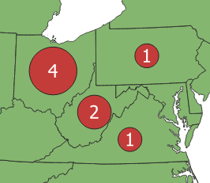

# Count values in multi-valued columns

Let's suppose we have a dataset of research studies conducted in various states, and we want to map how many studies took place in each state.  The tricky part is that some studies are associated with multiple states, and so our `studies` table may look something like this:

id | title       | place
---|-------------|------
1  | Study one   | Ohio
2  | Study two   | Virginia; Ohio
3  | Study three | West Virginia; Ohio
4  | Study four  | Ohio; West Virginia;Pennsylvania

In this example, we have used semicolons to delimit the mulitple values.  We chose semicolons instead of commas, just to avoid any potential problems when using the CSV file format.  Also note that there are semicolons with and without a space following.  The method below will handle both varieties.

The count of total studies by state should look like this:

place         | total
--------------|------
Ohio          | 4
Pennsylvania  | 1
Virginia      | 1
West Virginia | 2

QGIS Virtual Layers is a feature that allows us to write an SQL query to dynamically compute a new table or layer.  We can use it to run a query that will create the table of placename totals and automatically join those totals to state polygons from an existing layer.  The following query assumes that we have a polygon layer called `states` that includes a column called `name`.

- From the Layer menu, select "Create Layer > New Virtual Layer..."
- Set the Layer name to "state_totals"
- Enter the following SQL query:

```SQL
with temp as (
    with recursive splitvalues(id, val, more) as (
        select id, '', replace(place, '; ', ';') || ';'
        from studies
        union all
        select id, substr(more, 0, instr(more, ';')), substr(more, 1+instr(more, ';'))
        from splitvalues
        where more <> ''
    )
    select trim(val, '; ') as place, count(*) as total
    from splitvalues
    where val <> ''
    group by val
    order by val
)
select temp.place, total, centroid(geometry) as geometry
from temp left join states on temp.place=states.name
```

- Click the "Add" button

This should add a new layer called "state_totals" to your project.  Note that, by using a "left join", this layer only includes places that are listed in the studies table, and the output layer contains just the centroid points of the corresponding states.  We do this to make it easier to visualize the data on the map using point styles.  (Details forthcoming...)



The query above includes some recursive magic that helps to split the values as many times as necessary for all the semicolons.  Thanks to [Samuel Bosch's original recipe](http://www.samuelbosch.com/2018/02/split-into-rows-sqlite.html) which was modified to split on semicolons with or without a following space, and to remove any trailing punctuation from the final output.


